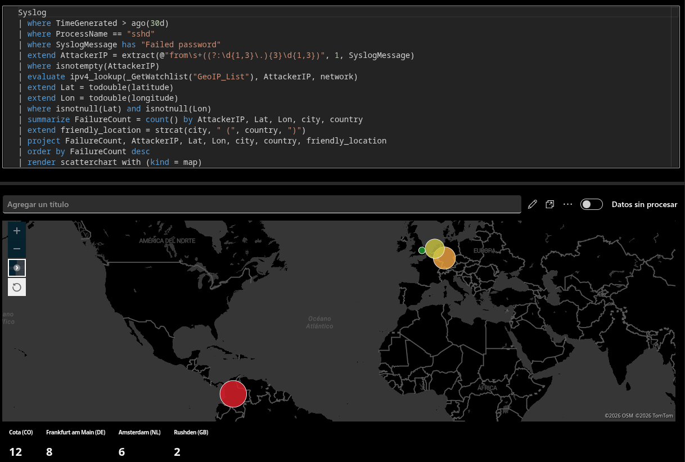
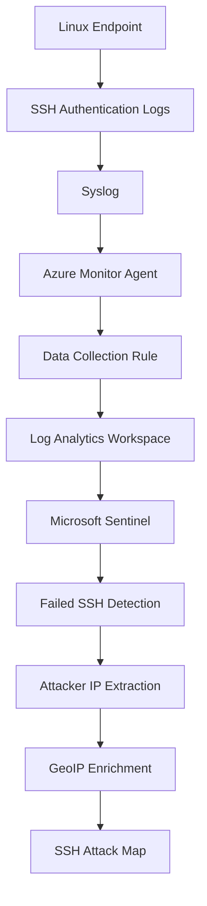

# Azure-Sentinel-SOC-Lab


Hands-on SOC laboratory designed to simulate and investigate SSH authentication attacks against a Linux endpoint using Microsoft Sentinel as the SIEM.

The project implements centralized Syslog ingestion, failed SSH authentication detection, attacker IP extraction, GeoIP enrichment using a Sentinel Watchlist, and geographic visualization through a custom Workbook.



## Project Overview

This laboratory demonstrates an end-to-end security monitoring workflow:



## Technologies

* Microsoft Sentinel
* Azure Log Analytics
* Azure Monitor Agent (AMA)
* Azure Data Collection Rules (DCR)
* Linux / Syslog
* Kusto Query Language (KQL)
* Sentinel Watchlists
* Sentinel Workbooks
* Python
* IP2Location LITE DB11

## Detection Pipeline

The laboratory starts with failed SSH authentication events generated by the Linux endpoint.

The detection process consists of:

1. Collecting Linux authentication logs through Syslog.
2. Ingesting the logs using Azure Monitor Agent.
3. Routing telemetry through a Data Collection Rule.
4. Storing the events in a Log Analytics Workspace.
5. Detecting failed SSH authentication attempts in Microsoft Sentinel.
6. Extracting the source IP address from the SSH event.
7. Enriching the IP with geographic information.
8. Aggregating the results for visualization.
9. Displaying the activity through a custom Sentinel Workbook.

## GeoIP Enrichment

The project uses a Sentinel Watchlist named `GeoIP_List` containing IPv4 network ranges and geographic information.

The enrichment process uses the KQL `ipv4_lookup` operator to correlate the source IP extracted from SSH events with the corresponding network range.

The resulting information includes:

* Country
* Region
* City
* Latitude
* Longitude

The GeoIP dataset is processed locally using Python before being integrated into Sentinel.

The original IP2Location dataset is not included in the repository.

## Evidence

The `Evidence/` directory contains screenshots documenting the main stages of the laboratory:

* Azure Linux VM
* Azure Monitor Agent
* Data Collection Rule configuration
* Syslog ingestion
* Failed SSH detection
* GeoIP enrichment
* SSH attack map

See [`Evidence/README.md`](Evidence/README.md) for the complete evidence flow.

## Repository Structure

```
Azure-Sentinel-SOC-Lab/
│
├── Architecture/
│   └── architecture.md
│
├── Azure/
│   └── DCR/
│       ├── DCR-backup.json
│       ├── DCR-SOC-LAB.json
│       └── README.md
│
├── Docs/
│   ├── deployment.md
│   ├── detection.md
│   └── lessons-learned.md
│
├── Evidence/
│   ├── README.md
│   └── *.png
│
├── GeoIP/
│   ├── attackerip_list.txt
│   ├── convertir_geoip.py
│   ├── crear_geoip_watchlist.py
│   ├── optimizar_geoip.py
│   └── README.md
│
├── Sentinel/
│   ├── Queries/
│   │   ├── attacker-ip-extraction.kql
│   │   ├── failed-ssh-logins.kql
│   │   ├── geoip-enrichment.kql
│   │   └── ssh-attack-map.kql
│   │
│   ├── WatchLists/
│   │   └── README.md
│   │
│   └── WorkBooks/
│       ├── README.md
│       └── ssh-attack-map.json
│
└── README.md
```

## Documentation

* [Architecture](Architecture/architecture.md)
* [Deployment](Docs/deployment.md)
* [Detection](Docs/detection.md)
* [Lessons Learned](Docs/lessons-learned.md)
* [DCR Configuration](Azure/DCR/README.md)
* [GeoIP Processing](GeoIP/README.md)
* [Watchlist](Sentinel/WatchLists/README.md)
* [Workbook](Sentinel/WorkBooks/README.md)
* [Evidence](Evidence/README.md)

## Limitations

The GeoIP enrichment is based on external geolocation data and should be considered contextual information rather than definitive attribution.

IP geolocation can be affected by:

* VPNs
* Proxies
* NAT
* Cloud infrastructure
* ISP address allocation
* Limitations of the underlying geolocation database

The laboratory is intended for controlled security monitoring and detection experimentation.

## Key Skills Demonstrated

* Linux security monitoring
* Syslog-based telemetry collection
* Azure Monitor Agent configuration
* Data Collection Rules
* Microsoft Sentinel
* KQL detection queries
* Source IP extraction
* Watchlist-based enrichment
* IPv4 network matching
* GeoIP data processing
* Security event visualization
* Security monitoring workflow